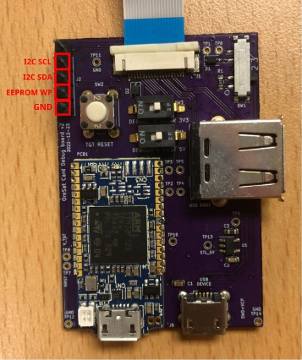

# Octavo EEPROM Flasher

This script will write a id value to the Octavo's EEPROM. When the Octavo is
booting, U-Boot will read the value from EEPROM in to figure out what device
tree to load, before booting up Linux.

This script will write the board id of a PocketBeagle to the EEPROM.

Id's can be found in the README of https://github.com/beagleboard/image-builder.

## Requirements

A laptop and [Raspi Pico].

## Setup Raspi Pico

Download the uf2 file to a laptop from: https://micropython.org/download/RPI_PICO/

While holding the Raspi Pico boot button, connect the Raspi Pico to the laptop.

The Raspi Pico will come up a as storage device, copy the `.uf2` file into the
storage device directory.

Disconnect and reconnect (without holding the boot button) the Raspi Pico.

Clone the oresat-linux repo on a laptop

```bash
$ git clone https://github.com/oresat/oresat-linux
$ cd oresat-linux/octavo_eeprom_flasher
```

Install dependencies on laptop

```bash
$ pip install -r requirements.txt
```

Flash `main.py` on Raspi Pico. Change the `/dev/ttyACM0` as needed.

```bash
$ ampy --port /dev/ttyACM0 put main.py
```

Disconnect the Raspi Pico.

## Writing to the EEPROM

Connect the Raspi Pico’s I2C and ground pins to the Octavo’s I2C-0, ground,
and write protection pins using a Debug Board.

| Debug Pin           | Raspi Pin |
|---------------------|-----------|
| Debug 1 (SCL)       | 22 (SCL)  |
| Debug 2 (SDA)       | 21 (SDA)  |
| Debug 3 (EEPROM WP) | 23 (GND)  |
| GND                 | 3 (GND)   |

**Warning:** Connection point to the Octavo's I2C-0 may change to be directly
on card and not debug board with future OreSat cards.



Power on the Octavo.

Connect the Raspi Pico to laptop (give it power).

Use the Raspi Pico LED to determine the status of the EEPROM flashing:

- If the LED is always off, the Raspi Pico binary is not flashed and/or the
  `main.py` is not running. Try reflashing the MicroPython binary and the
  `main.py` script onto the Raspi Pico.
- If the LED is blinking every second, the firmware is trying to flash the
  EEPROM and is failing, check the wiring.
- If the LED is always on, the EEPROM has been successfully flashed.

[Raspi Pico]: https://www.raspberrypi.com/documentation/microcontrollers/raspberry-pi-pico.html
