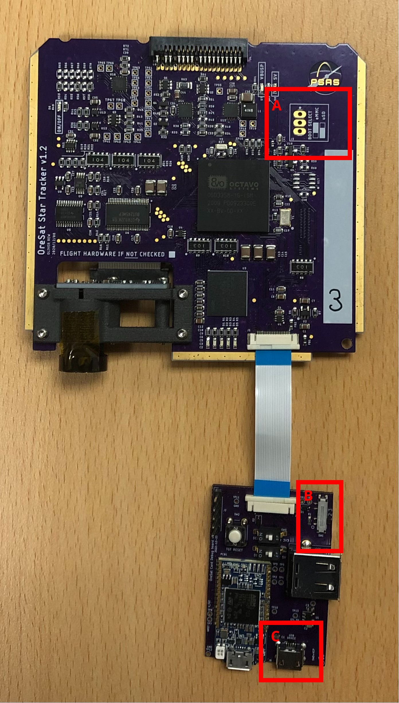

# Octavo USB-eMMC Flasher

This software allows a host computer to flash to the Octavo's eMMC via USB. It
is based on this guide:
https://octavosystems.com/app_notes/programming-emmc-with-usb/

However, Python is used instead of `dhcpd` and `xinetd` so it could be run as
a standalone script instead of needing to setup multiple services.

**NOTE:** This seems to most reliable to use a Raspberry Pi for this.

## How it Works

**NOTE:** This section is mostly copied from the Octavo Systems link above.
# This is copied in case the info at the link above is lost

1. A small, light-weight, initramfs (Initial RAM file system) based Linux image
   is booted on the “OSD335x Target Device” using [TFTP] over the USB
   interface.
2. The minimal image booted on the target will provide the “Host Computer”
   access to the attached eMMC memory as a mounted mass storage device,
   similar to a USB flash drive.
3. The “Host Computer” will copy the Linux image to the eMMC memory.

### Target Device Files

1. `u-boot-spl-restore.bin`: Second stage bootloader (SPL) requested by ROM
   code. Performs device initialization including DDR setup.
2. `u-boot-restore.img`: U-Boot bootloader requested by the SPL. Loads the
   Linux kernel, file system, and device tree into memory.
3. `uImage`: Linux kernel image with a U-Boot header describing the image.
   This kernel was built to support a RAM based filesystem and have the
   necessary USB gadget drivers to expose the eMMC device via USB as a
   mass storage device.
#. `initramfs`: Small filesystem built from Busybox that can live entirely
   within the DDR memory.
#. `osd3358-bsm-refdesing.dtb`: Device Tree Binary (dtb) describing the
   hardware configuration of the “Target Device”. This file is responsible
   for setting up the eMMC and the USB interfaces.

## Setup

Clone the oresat-linux repo

```bash
$ git clone https://github.com/oresat/oresat-linux
$ cd oresat-linux/octavo_usb_emmc_flasher/
```

Install dependencies

```bash
$ sudo pip3 install -r requirements.txt
```

## Boot Octavo via USB as USB mass storage

Remove the SD card if there is one. The SD card connector is generally on
bottom of OreSat card.

Connect a debug board to the OreSat card



Put the OreSat card is in SD card boot mode (Box A in image above)

Put the debug board in mode 2, aka VUSB straight to power Octavo (Box B in
image above).

Plug in OreSat card to host (Box C in image above) and see it appear as
network interface. For example, it can appears as `usb0`.

```bash
$ ip l
1: lo: <LOOPBACK,UP,LOWER_UP> mtu 65536 qdisc noqueue state UNKNOWN mode DEFAULT group default qlen 1000
  link/loopback 00:00:00:00:00:00 brd 00:00:00:00:00:00
2: eth0: <BROADCAST,MULTICAST,UP,LOWER_UP> mtu 1500 qdisc pfifo_fast state UP mode DEFAULT group default qlen 1000
 link/ether b8:27:eb:bb:98:75 brd ff:ff:ff:ff:ff:ff
3: usb0: <BROADCAST,MULTICAST,UP,LOWER_UP> mtu 1500 qdisc pfifo_fast state UNKNOWN mode DEFAULT group default qlen 1000
 link/ether 9a:1f:85:1c:3d:0e brd ff:ff:ff:ff:ff:ff
```

Run the boot script with the network interface and absolute path to the
`tfptboot` directory.

**NOTE::** This should be done within 10~15 seconds of the OreSat card being plugged in.

```bash
$ sudo python3 -m emmc_flasher usb0 ./tftpboot
INFO(tftpd): Serving TFTP requests on usb0/192.168.6.1:69 in /home/oresat/oresat-linux/octavo_boot/tftpboot
INFO(octavo-usb-boot): Handling 'AM335x ROM' BOOTP packet
INFO(bootpd): Offering to boot client 192.168.6.2
INFO(bootpd): Booting client 192.168.6.2 with file b'u-boot-spl-restore.bin'
INFO(tftpd): Serving file u-boot-spl-restore.bin to host 192.168.6.2...
INFO(tftpd): Transfer of file u-boot-spl-restore.bin completed.
INFO(octavo-usb-boot): Handling 'AM335x U-Boot SPL' BOOTP packet
INFO(bootpd): Offering to boot client 192.168.6.2
INFO(bootpd): Booting client 192.168.6.2 with file b'u-boot-restore.img'
INFO(octavo-usb-boot): Handling 'AM335x U-Boot SPL' BOOTP packet
INFO(bootpd): Offering to boot client 192.168.6.2
INFO(bootpd): Booting client 192.168.6.2 with file b'u-boot-restore.img'
INFO(tftpd): Serving file u-boot-restore.img to host 192.168.6.2...
INFO(tftpd): Transfer of file u-boot-restore.img completed.
INFO(octavo-usb-boot): Handling 'U-Boot.armv7' BOOTP packet
INFO(bootpd): Offering to boot client 192.168.6.2
INFO(bootpd): Booting client 192.168.6.2 with file b'u-boot-spl-restore.bin'
INFO(octavo-usb-boot): Handling 'U-Boot.armv7' BOOTP packet
INFO(bootpd): Offering to boot client 192.168.6.2
INFO(bootpd): Booting client 192.168.6.2 with file b'u-boot-spl-restore.bin'
INFO(tftpd): Serving file u-boot-spl-restore.bin to host 192.168.6.2...
INFO(tftpd): Transfer of file u-boot-spl-restore.bin completed.
INFO(tftpd): Serving file uImage to host 192.168.6.2...
INFO(tftpd): Transfer of file uImage completed.
INFO(tftpd): Serving file initramfs to host 192.168.6.2...
INFO(tftpd): Transfer of file initramfs completed.
INFO(tftpd): Serving file osd3358-bsm-refdesign.dtb to host 192.168.6.2...
INFO(tftpd): Transfer of file osd3358-bsm-refdesign.dtb completed.
```

After a minute a USB mass storage device appear on the host system. After
this, it is safe to kill the above script

```bash
$ dmesg -w
...
[177014.042105] usb-storage 1-1.1:1.0: USB Mass Storage device detected
[177014.044351] usb-storage 1-1.1:1.0: Quirks match for vid 0525 pid a4a5: 10000
[177014.044521] scsi host0: usb-storage 1-1.1:1.0
[177015.089132] scsi 0:0:0:0: Direct-Access     Linux    File-Stor Gadget 0414 PQ: 0 ANSI: 2
[177015.089789] scsi 0:0:0:0: Attached scsi generic sg0 type 0
[177015.092060] sd 0:0:0:0: [sda] 30777344 512-byte logical blocks: (15.8 GB/14.7 GiB)
[177015.199190] sd 0:0:0:0: [sda] Write Protect is off
[177015.199206] sd 0:0:0:0: [sda] Mode Sense: 0f 00 00 00
[177015.307238] sd 0:0:0:0: [sda] Write cache: enabled, read cache: enabled, doesn't support DPO or FUA
[177015.557922]  sda: sda1
[177015.775279] sd 0:0:0:0: [sda] Attached SCSI removable disk
...
```

```bash
$ lsblk
NAME        MAJ:MIN RM   SIZE RO TYPE MOUNTPOINT
sda           8:0    1  14.7G  0 disk
mmcblk0     179:0    0 119.3G  0 disk
├─mmcblk0p1 179:1    0   256M  0 part /boot
└─mmcblk0p2 179:2    0   119G  0 part /
```

## Download OS image

OreSat images can be found at https://images.oresat.org

Decompress images with `zstd`

```bash
$ zstd -d oresat-dev-2023-03-03.img.zst
```

## Write the image onto the eMMC

**Warning::** `dd` will flash to any storage device, even the one the system
is running on, so make sure you have the correct one. `/dev/sda` is
typically the first HDD or SSD storage device. The `lsblk` command will tell
you which storage device the system is running off of (it is the one it is
mounted to).

```bash
$ sudo dd status=progress if=oresat-dev-2023-03-03.img of=/dev/sda
```

Once `dd` is done, remove power, change the boot jumper to boot from eMMC,
and power up. The card should boot from eMMC with the new image.

[TFTP]: https://en.wikipedia.org/wiki/Trivial_File_Transfer_Protocol
